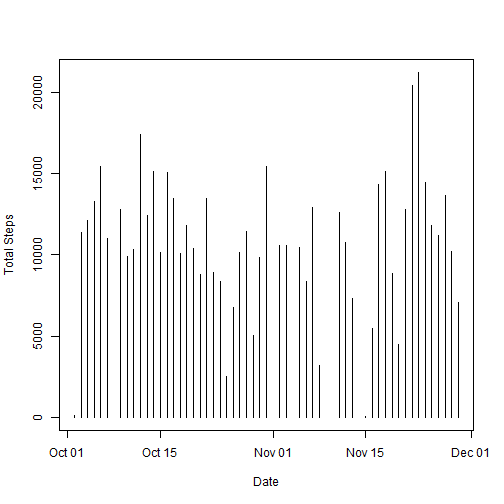
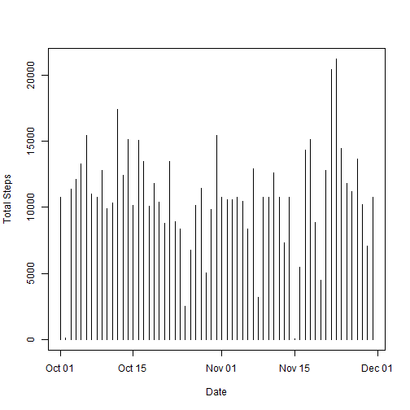
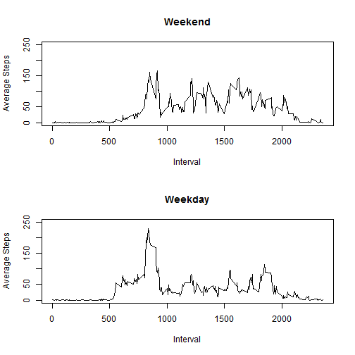

# Reproducible Research: Peer Assessment 1

## Loading and preprocessing the data


```r
setwd("C:/Base/Education/MOOC/Johns Hopkins - Data Science Specialization/Reproducible Research/RepData_PeerAssessment1");
library("utils")
if (!file.exists("activity.csv")) {
    unzip("activity.zip", overwrite=TRUE)
}
data_raw <- read.csv("activity.csv", header = TRUE, sep = ',')
data <- data_raw[complete.cases(data_raw),]
data$date <- as.Date(data$date)
head(data)
```

```
##     steps       date interval
## 289     0 2012-10-02        0
## 290     0 2012-10-02        5
## 291     0 2012-10-02       10
## 292     0 2012-10-02       15
## 293     0 2012-10-02       20
## 294     0 2012-10-02       25
```

```r
summary(data)
```

```
##      steps            date               interval   
##  Min.   :  0.0   Min.   :2012-10-02   Min.   :   0  
##  1st Qu.:  0.0   1st Qu.:2012-10-16   1st Qu.: 589  
##  Median :  0.0   Median :2012-10-29   Median :1178  
##  Mean   : 37.4   Mean   :2012-10-30   Mean   :1178  
##  3rd Qu.: 12.0   3rd Qu.:2012-11-16   3rd Qu.:1766  
##  Max.   :806.0   Max.   :2012-11-29   Max.   :2355
```

```r
str(data)
```

```
## 'data.frame':	15264 obs. of  3 variables:
##  $ steps   : int  0 0 0 0 0 0 0 0 0 0 ...
##  $ date    : Date, format: "2012-10-02" "2012-10-02" ...
##  $ interval: int  0 5 10 15 20 25 30 35 40 45 ...
```


## What is mean total number of steps taken per day?


```r
sum <- as.data.frame(tapply(data$steps, data$date, sum))
names(sum) <- c("total_steps")
```


```r
head(sum)
```

```
##            total_steps
## 2012-10-02         126
## 2012-10-03       11352
## 2012-10-04       12116
## 2012-10-05       13294
## 2012-10-06       15420
## 2012-10-07       11015
```

```r
summary(sum)
```

```
##   total_steps   
##  Min.   :   41  
##  1st Qu.: 8841  
##  Median :10765  
##  Mean   :10766  
##  3rd Qu.:13294  
##  Max.   :21194
```

```r
plot (
    x    = as.Date(rownames(sum)),
    y    = sum$total_steps,
    type = "h",
    xlab = "Date",
    ylab = "Total Steps"
)
```

 

```r
mean(sum$total_steps)
```

```
## [1] 10766
```

```r
median(sum$total_steps)
```

```
## [1] 10765
```


## What is the average daily activity pattern?


```r
avg <- as.data.frame(tapply(data$steps, data$interval, mean))
names(avg) <- c("average_steps")
```


```r
head(avg)
```

```
##    average_steps
## 0        1.71698
## 5        0.33962
## 10       0.13208
## 15       0.15094
## 20       0.07547
## 25       2.09434
```

```r
summary(avg)
```

```
##  average_steps   
##  Min.   :  0.00  
##  1st Qu.:  2.49  
##  Median : 34.11  
##  Mean   : 37.38  
##  3rd Qu.: 52.83  
##  Max.   :206.17
```

```r
plot (
    x    = rownames(avg),
    y    = avg$average_steps,
    type = "l",
    xlab = "Interval",
    ylab = "Average Steps"
)
```

 

```r
avg[which.max(avg[,1]),]
```

```
##   835 
## 206.2
```


## Imputing missing values

Calculate and report the total number of missing values in the dataset (i.e. the total number of rows with NAs)


```r
summary(data_raw$steps)[7]
```

```
## NA's 
## 2304
```

```r
sum(!complete.cases(data_raw))
```

```
## [1] 2304
```


```r
data_fill <- data_raw
data_fill$date <- as.Date(data_fill$date)

# Disused line
#data_fill[which(is.na(data_fill$steps)),1] <- 1000

# Using this instead
for (i in 1:length(data_raw$steps)) {
  if (is.na(data_fill[i,1])) {
    data_fill[i,1] <- as.numeric(avg[(data_fill[i,3]==rownames(avg)),1])
  }  
}

head(data_fill)
```

```
##     steps       date interval
## 1 1.71698 2012-10-01        0
## 2 0.33962 2012-10-01        5
## 3 0.13208 2012-10-01       10
## 4 0.15094 2012-10-01       15
## 5 0.07547 2012-10-01       20
## 6 2.09434 2012-10-01       25
```


```r
sum_fill <- as.data.frame(tapply(data_fill$steps, data_fill$date, sum))
names(sum_fill) <- c("total_steps")

plot (
    x    = as.Date(rownames(sum_fill)),
    y    = sum_fill$total_steps,
    type = "h",
    xlab = "Date",
    ylab = "Total Steps"
)
```

 

```r
mean(sum_fill$total_steps)
```

```
## [1] 10766
```

```r
median(sum_fill$total_steps)
```

```
## [1] 10766
```


## Are there differences in activity patterns between weekdays and weekends?


```r
data_diff <- data_fill
head(data_diff)
```

```
##     steps       date interval
## 1 1.71698 2012-10-01        0
## 2 0.33962 2012-10-01        5
## 3 0.13208 2012-10-01       10
## 4 0.15094 2012-10-01       15
## 5 0.07547 2012-10-01       20
## 6 2.09434 2012-10-01       25
```

```r
# The more intuitive way, but slower
for (i in 1:length(data_diff[, 2])) {
    if (weekdays(data_diff[i, 2])=="Saturday" | weekdays(data_diff[i, 2])=="Sunday") {
        data_diff$type[i]<-'weekend'
    } else {
        data_diff$type[i]<-'weekday'
    }
}

head(data_diff)
```

```
##     steps       date interval    type
## 1 1.71698 2012-10-01        0 weekday
## 2 0.33962 2012-10-01        5 weekday
## 3 0.13208 2012-10-01       10 weekday
## 4 0.15094 2012-10-01       15 weekday
## 5 0.07547 2012-10-01       20 weekday
## 6 2.09434 2012-10-01       25 weekday
```

```r
# A much faster way of doing it
weekday <- weekdays(data_diff$date, abbreviate = FALSE)
data_diff$type <- vector(length=length(data_diff$steps))
data_diff$type[weekday=="Sunday" | weekday=="Saturday"] <- "weekend"
data_diff$type[weekday!="Sunday" & weekday!="Saturday"] <- "weekday"
data_diff$type <- as.factor(data_diff$type)

head(data_diff)
```

```
##     steps       date interval    type
## 1 1.71698 2012-10-01        0 weekday
## 2 0.33962 2012-10-01        5 weekday
## 3 0.13208 2012-10-01       10 weekday
## 4 0.15094 2012-10-01       15 weekday
## 5 0.07547 2012-10-01       20 weekday
## 6 2.09434 2012-10-01       25 weekday
```


```r
avg_diff <- aggregate(data_diff$steps, list(data_diff$interval, data_diff$type), mean)

head(avg_diff)
```

```
##   Group.1 Group.2       x
## 1       0 weekday 2.25115
## 2       5 weekday 0.44528
## 3      10 weekday 0.17317
## 4      15 weekday 0.19790
## 5      20 weekday 0.09895
## 6      25 weekday 1.59036
```

```r
par(mfrow = c(2,1))

plot(x      = avg_diff[avg_diff$Group.2=="weekend",1], 
     y      = avg_diff[avg_diff$Group.2=="weekend",3], 
     xlab   = "Interval", 
     ylab   = "Average Steps", 
     type   ="l", 
     main   ="Weekend", 
     ylim   =c(0,250)
)

plot(x      = avg_diff[avg_diff$Group.2=="weekday",1], 
     y      = avg_diff[avg_diff$Group.2=="weekday",3], 
     xlab   = "Interval", 
     ylab   = "Average Steps", 
     type   ="l",
     main   ="Weekday",
     ylim   =c(0,250)
)
```

 
